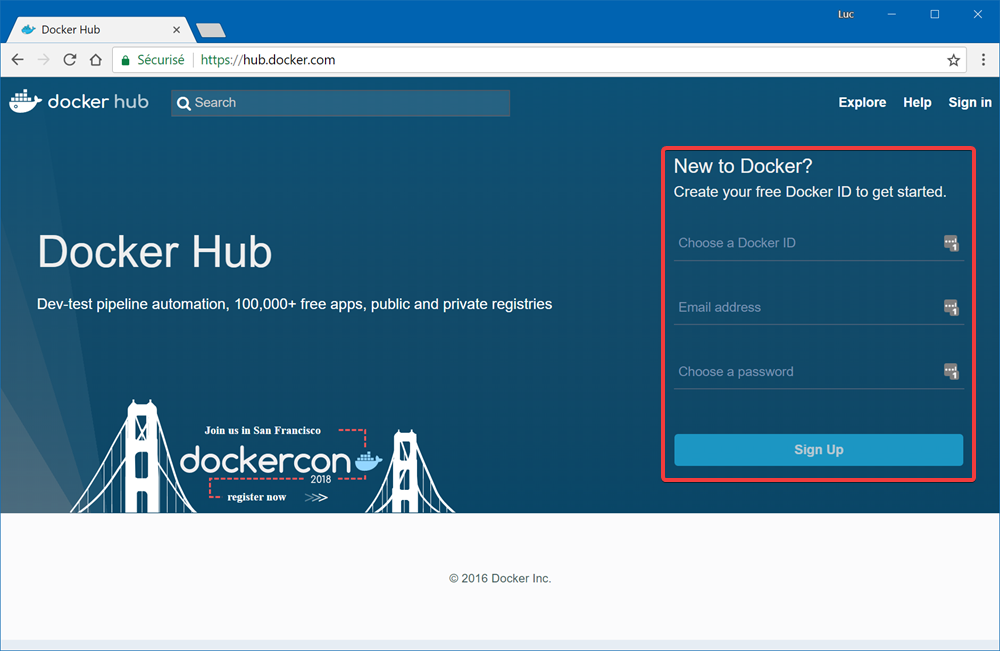
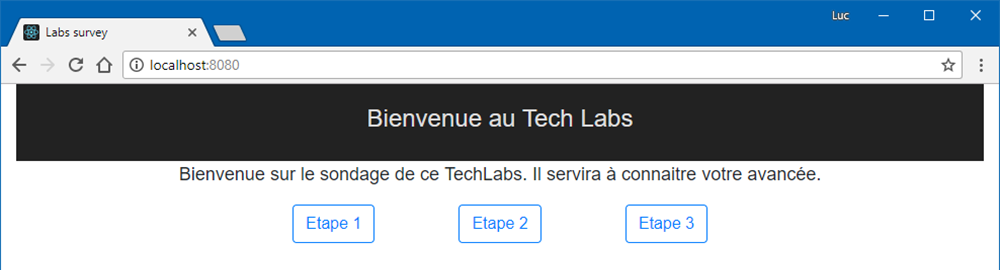

# Build de l'image et test local sur docker

Nous partons sur le projet Lab survey ([https://github.com/Riges/lab-survey](https://github.com/Riges/lab-survey)). Cela va nous permettre d'avoir un front et son api dissociés du stockage qui sera un Redis.
Pour préparer l'exercice, nous avons fait cela dans le répertoire **src** qui sera notre repertoire de travail, vous n'avez donc pas besoin de clonner le projet.

## Préambule : Docker Hub

Lors de ce Techlab, nous serons nombreux à utiliser la même IP pour demander les images au docker hub. Pour s'assurer de ne pas être limité, nous prendrons le parti de nous identifier sur le Docker Hub.

### Identification

Afin de pouvoir vous identifier sur le docker hub, il va falloir vous enregistrer. Il vous suffit d'aller sur [https://hub.docker.com](https://hub.docker.com) et vous devriez tomber sur le formulaire d'inscription. 

Une fois fait, il vous reste l'étape de **login** depuis votre terminal en saisissant l'identifiant précédemment choisi.

`docker login -u VOTRE-USERNAME`

```sh
>  docker login -u VOTRE-USERNAME
Password:
Login Succeeded
```

## Definition des services 📝

Afin de pouvoir créer les conteneurs nécessaires, nous nous servirons du fichier `docker-compose.yml` qui se décompose en trois services. Pour ce faire, nous utiliserons le format docker-compose en **version 3** permettant de déclarer les services comme tel :

```yaml
version: '3'

services:
  ServiceA: ...
  ServiceB: ...
```

### Le service redis

Ce que nous voulons, c'est un conteneur du nom **lab-survey-redis** basé sur l'image **redis** et qui demande d'exposer son port **6379**, celui par défaut de redis, sur le port **6379** de l'host docker. On obtient donc la configuration suivante :

```yaml
lab-survey-redis:
  image: redis
  container_name: lab-survey-redis
  ports:
    - '6379:6379'
```

### Le service api

#### Le Dockerfile de l'api

Pour construire l'image, nous aurons besoin d'un 'Dockerfile', un fichier permettant de définir le processus de construction de l'image, que nous mettrons à coté du fichier _lab-survey-api.csproj_. Le programme étant en .Net Core et comme Microsoft nous fournit tous les outils, nous ferons un _multi-stage build_ permettant d'avoir une étape de build de l'application sur une image dédiée. Puis nous récupérerons le résultat du build pour lancer l'application sur une image dédiée à l'hébergement de cette application.

Pour la partie build de l'application, nous utiliserons l'image **microsoft/dotnet:2.1-sdk-alpine** que nous nommerons **build-env** et nous travaillerons dans le répertoire **/src**. Comme les dépendances changent moins que le code source d'une application, nous nous en occuperons en premier afin que cette partie de l'image reste en cache. Pour pouvoir restaurer les dépendances grâce à la commande 'dotnet restore', nous copierons le fichier **lab-survey-api.csproj** dans l'image. Une fois cela fait, nous copierons le reste des sources dans l'image et nous utiliserons la commande 'dotnet publish' en spécifiant que nous voulons la configuration **Release** et que le répertoire de sortie sera nommé **out**.

```Dockerfile
FROM microsoft/dotnet:2.1-sdk-alpine AS build-env
WORKDIR /src
COPY lab-survey-api.csproj .
RUN dotnet restore
COPY . .
RUN dotnet publish -c Release -o out
```

Pour l'étape d'hébergement de l'application compilée, nous utiliserons l'image **microsoft/dotnet:2.1-aspnetcore-runtime-alpine** en copiant les fichiers générés par l'étape **build-env** dans le répertoire **/src/out** dans le répertoire de travail courant de cette image **/app**. Nous lui préciserons une variable d'environnement, **ASPNETCORE_URLS**, permettant de choisir le format d'url de l'application (**http://+:5000**) ce qui permettra de connaitre le port/tcp à exposer. Le point d'entrée de l'image se fera sur la commande **dotnet** en utilisant la dll générée par l'étape de build **lab-survey-api.dll**.

```Dockerfile
FROM microsoft/dotnet:2.1-aspnetcore-runtime-alpine
WORKDIR /app
COPY --from=build-env /src/out ./
ENV ASPNETCORE_URLS=http://+:5000
EXPOSE 5000/tcp
ENTRYPOINT ["dotnet", "lab-survey-api.dll"]
```

Une fois cela dans le meme ficher cela devrais donner :

```Dockerfile
FROM microsoft/dotnet:2.1-sdk-alpine AS build-env
WORKDIR /src
COPY lab-survey-api.csproj .
RUN dotnet restore
COPY . .
RUN dotnet publish -c Release -o out

FROM microsoft/dotnet:2.1-aspnetcore-runtime-alpine
WORKDIR /app
COPY --from=build-env /src/out ./
ENV ASPNETCORE_URLS=http://+:5000
EXPOSE 5000/tcp
ENTRYPOINT ["dotnet", "lab-survey-api.dll"]
```

#### La définition de la configuration

Pour ce conteneur, on voudra le nommer **lab-survey-api** et on exposera le port **5000** du conteneur sur le port **8081** de l'hôte. On va aussi définir une variable d'environnement portant la clef **REDIS** et qui contiendra le nom du conteneur du redis (**lab-survey-redis**) afin de pouvoir l'appeler depuis l'application et une autre clef **ASPNETCORE_ENVIRONMENT** permettant de stipuler pour quel type d'environnement est buildée l'image (**Production**). Pour l'image, nous ne partons pas d'une existante. C'est pourquoi, nous devons la builder depuis le fichier 'Dockerfile' du dossier de l'application. Pour cela, nous allons définir un paramètre **build** et lui donner le chemin du dossier parent de ce Dockerfile précédemment créé : **./lab-survey-api/lab-survey-api/**. Pour nommer l'image, nous prendrons **lab-survey-api** dans le but de s'en servir à nouveau sans la builder à nouveau.

En prenant tout cela en compte, on devrait avoir une configuration ressemblant à :

```yaml
lab-survey-api:
  image: lab-survey-api
  container_name: lab-survey-api
  build:
    context: ./lab-survey-api/lab-survey-api/
    dockerfile: Dockerfile
  environment:
    REDIS: lab-survey-redis
    ASPNETCORE_ENVIRONMENT: Production
  ports:
    - '8081:5000'
```

### Le service front

#### Le Dockerfile du front

Nous repartirons sur un _multi-stage build_, et nous utiliserons l'image **node:alpine** pour l'image de build (que nous nommerons **builder**), on commencera cette fois ci par copier les dossiers package.json et yarn.lock afin de récupérer les dépendances du projet et optimiser le cache. Puis nous voudrons copier le reste afin de pouvoir builder le projet en utilisant la commande 'yarn run build'.

```Dockerfile
FROM node:alpine AS builder
WORKDIR /app
COPY package.json yarn.lock ./
RUN yarn install
COPY . .
RUN yarn run build
```

Ensuite, nous passerons au stage permettant d'héberger notre site statique et pour cela nous prendrons l'image **nginx:alpine** et nous nous contenterons de copier le dossier **/app/build** depuis le stage **builder** vers le dossier **/usr/share/nginx/html**.

```Dockerfile
FROM nginx:alpine
COPY --from=builder /app/build /usr/share/nginx/html
```

#### La définition de la configuration du front

En ce basant sur ce qu'on a vu avant entre le redis et l'api, nous pouvons facilement faire la configuration du front. Pour cela, on va nommer le service et l'image **lab-survey-front**, on va lui demander de build l'image avec le dockerfile précédemment créé, puis on exposera le port **80** du conteneur vers le port **8080** de l'host.

```yaml
lab-survey-front:
  image: lab-survey-front
  build:
    context: ./lab-survey-front
    dockerfile: Dockerfile
  container_name: lab-survey-front
  ports:
    - '8080:80'
```

## Build 🏭 et déploiement 🚢 des images

Il est temps d'utiliser Docker afin de construire ces images et les stocker dans la registry local. Pour ce faire, nous utiliserons la commande 'docker-compose' afin d'arriver au résultat voulu.

### Vérification du fichier docker-compose.yml

Pour être sûr que nous n'avons pas d'erreur dans le fichier, nous utiliserons la commande **config** avec comme paramètre le nom du fichier suivant **-f ./docker-compose.yml**. On obtient alors `docker-compose -f ./docker-compose.yml config`. Si tout fonctionne, on doit voir s'afficher les lignes suivantes :

```sh
> docker-compose -f ./docker-compose.yml config
services:
  lab-survey-api:
    build:
      context: C:\Users\Riges\code\lab-survey\lab-survey-api\lab-survey-api
      dockerfile: Dockerfile
    container_name: lab-survey-api
    environment:
      ASPNETCORE_ENVIRONMENT: Production
      REDIS: lab-survey-redis
    image: lab-survey-api
    ports:
    - 8081:5000/tcp
  lab-survey-front:
    build:
      context: C:\Users\Riges\code\lab-survey\lab-survey-front
      dockerfile: Dockerfile
    container_name: lab-survey-front
    image: lab-survey-front
    ports:
    - 8080:80/tcp
  lab-survey-redis:
    container_name: lab-survey-redis
    image: redis
    ports:
    - 6379:6379/tcp
version: '3.0'
```

### Build des images 🏭

La commande **build** nous permettra de construire l'image sans pour autant la déployer en local. Suite à cela, nous pourrons vérifier la présence des images. Pour y parvenir, nous utiliserons les commandes 'docker-compose build' et 'docker images'.

```sh
> docker-compose build
lab-survey-redis uses an image, skipping
Building lab-survey-api
Step 1/12 : FROM microsoft/dotnet:2.1-sdk-alpine AS build-env
2.1-sdk-alpine: Pulling from microsoft/dotnet
ff3a5c916c92: Pull complete
11db6e8cd98a: Pull complete
452ce6452b15: Pull complete
010db6564c69: Pull complete
63890a0d0097: Pull complete
Digest: sha256:5cacc42d083b0ac801bb35525879dbb0fcef196ecf7ae83ff6466f582c4806ac
Status: Downloaded newer image for microsoft/dotnet:2.1-sdk-alpine
 ---> d5accd0a6f97
Step 2/12 : WORKDIR /src
 ---> b164017186e4
Step 3/12 : COPY lab-survey-api.csproj .
 ---> 8e746f83d09a
Step 4/12 : RUN dotnet restore
 ---> Running in 38ea035d132a
  Restoring packages for /src/lab-survey-api.csproj...
  Installing Microsoft.NETCore.DotNetAppHost 2.1.0.
  Installing System.Memory 4.5.0.
  Installing Microsoft.NETCore.DotNetHostResolver 2.1.0.
  Installing Microsoft.Extensions.DependencyInjection.Abstractions 2.1.0.
  Installing Microsoft.Extensions.Primitives 2.1.0.
  Installing Microsoft.NETCore.DotNetHostPolicy 2.1.0.
  Installing Microsoft.NETCore.Targets 2.1.0.
  Installing Microsoft.Extensions.Options 2.1.0.
  Installing Microsoft.Extensions.Caching.Abstractions 2.1.0.
  Installing Microsoft.NETCore.App 2.1.0.
  Installing Microsoft.Extensions.Caching.Redis 2.1.0.
  Generating MSBuild file /src/obj/lab-survey-api.csproj.nuget.g.props.
  Generating MSBuild file /src/obj/lab-survey-api.csproj.nuget.g.targets.
  Restore completed in 6.39 sec for /src/lab-survey-api.csproj.
Removing intermediate container 38ea035d132a
 ---> 0e32ec3d8691
Step 5/12 : COPY . .
 ---> c72ad0e153b7
Step 6/12 : RUN dotnet publish -c Release -o out
 ---> Running in 3053e1c76aa9
Microsoft (R) Build Engine version 15.7.179.6572 for .NET Core
Copyright (C) Microsoft Corporation. All rights reserved.

  Restore completed in 66.93 ms for /src/lab-survey-api.csproj.
  lab-survey-api -> /src/bin/Release/netcoreapp2.1/lab-survey-api.dll
ff3a5c916c92: Already exists
11db6e8cd98a: Already exists
 ---> 52b19f9b92f1
Step 7/12 : FROM microsoft/dotnet:2.1-aspnetcore-runtime-alpine
2.1-aspnetcore-runtime-alpine: Pulling from microsoft/dotnet
05b20ec7801c: Pull complete
Digest: sha256:2a0a8aa22ab959d4491af235f264dcbc37c2e5f098965bf2d76df84159773ef0
Status: Downloaded newer image for microsoft/dotnet:2.1-aspnetcore-runtime-alpine
 ---> a50663099cc8
Step 8/12 : WORKDIR /app
Removing intermediate container 761797936e69
 ---> c8adf757c59b
Step 9/12 : COPY --from=build-env /src/out ./
 ---> 62b6ecaa0b63
Step 10/12 : ENV ASPNETCORE_URLS=http://+:5000
 ---> Running in 60518bd3bbcb
Removing intermediate container 60518bd3bbcb
 ---> 16b958c05198
Step 11/12 : EXPOSE 5000/tcp
 ---> Running in 642af28c4255
Removing intermediate container 642af28c4255
 ---> 76f31892a408
Step 12/12 : ENTRYPOINT ["dotnet", "lab-survey-api.dll"]
 ---> Running in d958ee12d406
Removing intermediate container d958ee12d406
 ---> 25e67f98f557
Successfully built 25e67f98f557
Successfully tagged lab-survey-api:latest
Building lab-survey-front
Step 1/8 : FROM node:alpine AS builder
alpine: Pulling from library/node
ff3a5c916c92: Already exists
94f111771efe: Pull complete
87fbae1a7501: Pull complete
Digest: sha256:628d6994c7b950fda874dbb3bd04be6e5323c311c5c5e485aebe583c3e25b56f
Status: Downloaded newer image for node:alpine
 ---> c81046dc8599
Step 2/8 : WORKDIR /app
Removing intermediate container d499dd1990b0
 ---> cedce105ece0
Step 3/8 : COPY package.json yarn.lock ./
 ---> 5ff3d17e8a1e
Step 4/8 : RUN yarn install
 ---> Running in 6c6e9653ca71
...
ff3a5c916c92: Already exists
Step 7/8 : FROM nginx:alpine
alpine: Pulling from library/nginx
d81b148fab7c: Pull complete
f9fe12447daf: Pull complete
ad017fd52da2: Pull complete
Digest: sha256:4a85273d1e403fbf676960c0ad41b673c7b034204a48cb32779fbb2c18e3839d
Status: Downloaded newer image for nginx:alpine
 ---> bc7fdec94612
Step 8/8 : COPY --from=builder /app/build /usr/share/nginx/html
 ---> 2658a35b994e
Successfully built 2658a35b994e
Successfully tagged lab-survey-front:latest
> docker images
REPOSITORY          TAG                             IMAGE ID            CREATED             SIZE
lab-survey-front    latest                          2658a35b994e        45 seconds ago      22.5MB
lab-survey-api      latest                          25e67f98f557        4 minutes ago       163MB
node                alpine                          c81046dc8599        5 days ago          69.9MB
redis               latest                          55cb7014c24f        5 days ago          83.4MB
microsoft/dotnet    2.1-sdk-alpine                  d5accd0a6f97        7 days ago          1.46GB
microsoft/dotnet    2.1-aspnetcore-runtime-alpine   a50663099cc8        7 days ago          162MB
nginx               alpine                          bc7fdec94612        2 weeks ago         18MB
```

Sur ce retour, nous remarquons deux informations importantes :

- _lab-survey-redis uses an image, skipping_ signifiant que lab-survey-redis n'a pas besoin d'être build car ce n'est qu'une définition du conteneur
- _lab-survey-front_ a bien été buildé il y a 45 secondes et que l'image porte l'id **2658a35b994e**. Et _lab-survey-api_ a été builder 4 minutes avant et porte l'id **25e67f98f557**. Elles sont à présent dans la liste des images disponibles.

### Deployer localement 🚢

Pour déployer localement, il faut utiliser la commande **up** suivie du paramètre **-d** afin de détacher les conteneurs du terminal qui a lancé la commande et ainsi éviter que la commande ne se termine pas une fois le terminal fermé.

`docker-compose up -d`

```sh
> docker-compose up -d
Creating network "lab-survey_default" with the default driver
Pulling lab-survey-redis (redis:)...
latest: Pulling from library/redis
4d0d76e05f3c: Pull complete
cfbf30a55ec9: Pull complete
82648e31640d: Pull complete
fb7ace35d550: Pull complete
497bf119bebf: Pull complete
89340f6074da: Pull complete
Digest: sha256:4aed8ea5a5fc4cf05c8d5341b4ae4a4f7c0f9301082a74f6f9a5f321140e0cd3
Status: Downloaded newer image for redis:latest
Creating lab-survey-api   ... done
Creating lab-survey-redis ... done
Creating lab-survey-front ... done
```

Si tout s'est bien passé, vous devriez voir un retour comme ci-dessus. Cependant, pour vérifier que les conteneurs sont bien lancés, deux solutions s'offrent à vous :

- aller sur [http://localhost:8080](http://localhost:8080) 
- lancer une commande 'docker ps --filter name=lab-survey' afin de voir les conteneurs lancés actuellement en filtrant par leurs noms.

```sh
> docker ps --filter name=lab-survey
CONTAINER ID        IMAGE               COMMAND                  CREATED             STATUS              PORTS                    NAMES
f79bdde0ad7c        lab-survey-api      "dotnet lab-survey-a…"   14 hours ago        Up 5 seconds        0.0.0.0:8081->5000/tcp   lab-survey-api
131126b871d9        lab-survey-front    "nginx -g 'daemon of…"   14 hours ago        Up 6 seconds        0.0.0.0:8080->80/tcp     lab-survey-front
db4c794fc3ec        redis               "docker-entrypoint.s…"   14 hours ago        Up 5 seconds        0.0.0.0:6379->6379/tcp   lab-survey-redis
```

## Félicitation, vous avez déployé votre application. 🎊🏆🎉

Voilà maintenant, vous savez comment construire un **DockerFile**, un fichier _docker-compose_, ainsi que builder et deployer des conteneurs.

## La suite

Pour continuer je vous invite à rejoindre l'étape 2 <a href="./2 - Les ressources Azure.md">Les ressources Azure</a>
