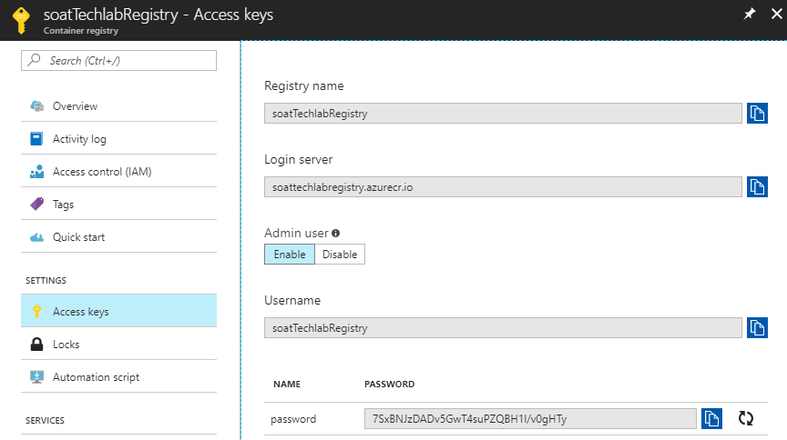

# Etape 2 - Les ressources Azure

Maintenant que l'application est prête, il nous faut une infrastructure. Pour la créer, nous utiliserons Azure Cli.

## Login

Pour interargir avec votre souscription Azure il faut vous identifier dans azure cli. Pour cela nous tapperons la commande `az login`

```sh
> az login
To sign in, use a web browser to open the page https://microsoft.com/devicelogin and enter the code CW36ZK6Q3 to authenticate.
[
  {
    "cloudName": "AzureCloud",
    "id": "8f4fa8e1-bce7-418f-832b-1da3d150acaf",
    "isDefault": true,
    "name": "SoCloudSandbox",
    "state": "Enabled",
    "tenantId": "1c732489-346b-4a9a-a417-4f09c23378a7",
    "user": {
      "name": "luc.fasquelle@soat.fr",
      "type": "user"
    }
  }
]
```

## Resource groupe

Afin de centraliser les ressources crées lors de ce Techlabs, nous crérons une ressource groupe du nom de **soat-techlab** dans la region **west europe** (comme tout le reste de nos ressources). On obtient alors la resource suivante `az group create --name soat-techlab --location westeurope`. Ce qui nous donne :

```sh
> az group create --name soat-techlab --location westeurope
{
  "id": "/subscriptions/1c732489-346b-4a9a-a417-4f09c23378a7/resourceGroups/soat-techlab",
  "location": "westeurope",
  "managedBy": null,
  "name": "soat-techlab",
  "properties": {
    "provisioningState": "Succeeded"
  },
  "tags": null
}
```

## Container Registry

### Création de la registry

Afin de permettre d'heberger vos images en dehors de votre ordinateur, sans pour autant les mettre sur le docker hub (registry public par defaut de docker), nous allons créer une registry. Nous utiliserons donc la commande **acr create**, la nommerons **soatTechlabRegistry** et nous choisirons le tarif **Basic**. Ce qui devrait donner `az acr create --resource-group soat-techlab --name soatTechlabRegistry --location westeurope --sku Basic` et un retour de succes comme :

```sh
> az acr create --resource-group soat-techlab --name soatTechlabRegistry --location westeurope --sku Basic
{
  "adminUserEnabled": false,
  "creationDate": "2018-07-03T12:25:07.846642+00:00",
  "id": "/subscriptions/1c732489-346b-4a9a-a417-4f09c23378a7/resourceGroups/soat-techlab/providers/Microsoft.ContainerRegistry/registries/soatTechlabRegistry",
  "location": "westeurope",
  "loginServer": "soattechlabregistry.azurecr.io",
  "name": "soatTechlabRegistry",
  "provisioningState": "Succeeded",
  "resourceGroup": "soat-techlab",
  "sku": {
    "name": "Basic",
    "tier": "Basic"
  },
  "status": null,
  "storageAccount": null,
  "tags": {},
  "type": "Microsoft.ContainerRegistry/registries"
}
```

### Identification

Avant de pouvoir envoyer des images dans la registry, il faut s'y connecter pour avoir les credentials. Pour cela, nous utiliserons la commande `az acr login --name soatTechlabRegistry`.

```sh
> az acr login --name soatTechlabRegistry
Login Succeeded
```

### Envoyer les images

Pour pouvoir envoyé les image sur le registry il nous faut l'url d'accès du répository, qui devrait normalement être pour cet exemple _**soattechlabregistry**.azurecr.io_. Mais afin d'en avoir la certitude vous pouvez faire :

`az acr list --resource-group soat-techlab --query "[].{acrLoginServer:loginServer}" --output table`

```sh
> az acr list --resource-group soat-techlab --query "[].{acrLoginServer:loginServer}" --output table
AcrLoginServer
------------------------------
soattechlabregistry.azurecr.io
```

Avec cet url, vous pourrez tagger et pousser sur vos images sur le repository en utilisant les commandes **tag** et **push** de docker. Pour les **tagger** il faut suivre la nomenclature **SERVEUR/NOM-DE-L-IMAGE:NUMEROS-DE-VERSION**, ce qui pour le cas de **lab-survey-front** et **lab-survey-api** donnerais _soattechlabregistry.azurecr.io/lab-survey-front:1.0_ et _soattechlabregistry.azurecr.io/lab-survey-api:1.0_. La commande donnerais donc `docker tag lab-survey-front soattechlabregistry.azurecr.io/lab-survey-front:1.0` et `docker tag lab-survey-api soattechlabregistry.azurecr.io/lab-survey-api:1.0`

```sh
> docker tag lab-survey-front soattechlabregistry.azurecr.io/lab-survey-front:1.0
  docker tag lab-survey-api soattechlabregistry.azurecr.io/lab-survey-api:1.0
```

Après, il vous suffit de **push** les images en se servant de leurs tags. Cela devrait être `docker push lab-survey-front soattechlabregistry.azurecr.io/lab-survey-front:1.0` et `docker push soattechlabregistry.azurecr.io/lab-survey-api:1.0`.

```sh
> docker push soattechlabregistry.azurecr.io/lab-survey-front:1.0
The push refers to repository [soattechlabregistry.azurecr.io/lab-survey-front]
c93118a949a1: Pushed
951c1d7bace7: Pushed
91295ee17337: Pushed
423678709065: Pushed
cd7100a72410: Pushed
1.0: digest: sha256:66409c7f857ced72396c856267ec46f411a948b8a831a83a6394c6c5c70fa506 size: 1364

> docker push soattechlabregistry.azurecr.io/lab-survey-api:1.0
The push refers to repository [soattechlabregistry.azurecr.io/lab-survey-api]
3df8aa90098e: Pushed
afb1a159c90a: Pushed
977b5e8acdb8: Pushed
84624cc68e71: Pushed
cd7100a72410: Mounted from lab-survey-front
1.0: digest: sha256:7c128219c574abc97f55edcd60a01208db2261f2172fd20e9e4b5a26f87fe7ab size: 1367
```

Si tout fonctionne bien, elles devraient être dans la registry, mais vérifions donc en utilisant la commande `az acr repository list --name soatTechlabRegistry --output table`.

```sh
> az acr repository list --name soatTechlabRegistry --output table
Result
----------------
lab-survey-api
lab-survey-front
```

## Cluster Kubernetes

### Création du cluster

La commande sur Azure Cli permettant d'intéragir avec des cluster Kubernetes est **aks** et plus précisément **aks create**, si on veux créer un cluster. On le nommera **soatTechlabCluster**. On voudra **un** node **Standard A1 v2** car il s'agit d'un cluster de test donc pas besoin de voir trop grand. Il faudra aussi générer la clef ssh afin de pouvoir se connecter avec les outils dédiés à Kubernetes.

`az aks create --resource-group soat-techlab --name soatTechlabCluster --node-count 1 --node-vm-size Standard_A1_v2 --generate-ssh-keys`

```sh
> az aks create --resource-group soat-techlab --name soatTechlabCluster --node-count 1 --node-vm-size Standard_A1_v2 --generate-ssh-keys
{
  "aadProfile": null,
  "addonProfiles": null,
  "agentPoolProfiles": [
    {
      "count": 1,
      "dnsPrefix": null,
      "fqdn": null,
      "maxPods": 110,
      "name": "nodepool1",
      "osDiskSizeGb": null,
      "osType": "Linux",
      "ports": null,
      "storageProfile": "ManagedDisks",
      "vmSize": "Standard_A1_v2",
      "vnetSubnetId": null
    }
  ],
  "dnsPrefix": "soatTechla-soat-techlab-8f4fa8",
  "enableRbac": false,
  "fqdn": "soattechla-soat-techlab-8f4fa8-224644c9.hcp.westeurope.azmk8s.io",
  "id": "/subscriptions/1c732489-346b-4a9a-a417-4f09c23378a7/resourceGroups/soat-techlab/providers/Microsoft.ContainerService/managedClusters/soatTechlabCluster",
  "kubernetesVersion": "1.9.6",
  "linuxProfile": {
    "adminUsername": "azureuser",
    "ssh": {
      "publicKeys": [
        {
          "keyData": "..."
        }
      ]
    }
  },
  "location": "westeurope",
  "name": "soatTechlabCluster",
  "networkProfile": {
    "dnsServiceIp": "10.0.0.10",
    "dockerBridgeCidr": "172.17.0.1/16",
    "networkPlugin": "kubenet",
    "networkPolicy": null,
    "podCidr": "10.244.0.0/16",
    "serviceCidr": "10.0.0.0/16"
  },
  "nodeResourceGroup": "MC_soat-techlab_soatTechlabCluster_westeurope",
  "provisioningState": "Succeeded",
  "resourceGroup": "soat-techlab",
  "servicePrincipalProfile": {
    "clientId": "54e7ec3f-e4bc-4249-895c-9eed12de6907",
    "keyVaultSecretRef": null,
    "secret": null
  },
  "tags": null,
  "type": "Microsoft.ContainerService/ManagedClusters"
}
```

Maintenant, nous allons récupérer les credentials pour réaliser la suite. Pour ce faire, nous utiliserons la commande **aks get-credential** en précisant la ressource groupe et le nom du cluster.

`az aks get-credentials --resource-group soat-techlab --name soatTechlabCluster`

```sh
> az aks get-credentials --resource-group soat-techlab --name soatTechlabCluster
Merged "soatTechlabCluster" as current context in C:\Users\Riges\.kube\config
```

Une fois l'opération réalisée, nous pourrons donc maintenant utiliser **kubetctl** qui est l'outil permettant de gérer son cluster kubernetes en ligne de commande. Pour connaitre l'information sur les noeuds, ce sont les vm dans le cluster, il faut utiliser la commande `kubectl get nodes`.

```sh
> kubectl get nodes
NAME                       STATUS    ROLES     AGE       VERSION
aks-nodepool1-49289993-0   Ready     agent     11m       v1.9.6
```

> #### Information
>
> Si vous voulez visualiser et manager les pods , les nodes du cluster, ainsi que les ressources en cours d'utilisation vous pouvez lancer l'application Kubernetes Dashbord qui est un exemple d'interface web fournis par l'équipe du projet. Pour Azure, vous avez la possibilité d'utiliser celle fournie grâce aux commandes d'Azure cli : `az aks browse --resource-group soat-techlab --name soatTechlabCluster`

### Mise à jour du cluster

Pour mettre à jour votre cluster vers une autre version de Kubernetes, il faut commencer par connaitre les migrations possible sur votre cluster en lançant la commande **get-versions**.

`az aks get-versions --location westeurope --output table`

```sh
> az aks get-versions --location westeurope --output table
KubernetesVersion    Upgrades
-------------------  -------------------------------------------------------------------------
1.10.3               None available
1.9.6                1.10.3
1.9.2                1.9.6, 1.10.3
1.9.1                1.9.2, 1.9.6, 1.10.3
1.8.11               1.9.1, 1.9.2, 1.9.6
1.8.10               1.8.11, 1.9.1, 1.9.2, 1.9.6
1.8.7                1.8.10, 1.8.11, 1.9.1, 1.9.2, 1.9.6
1.8.6                1.8.7, 1.8.10, 1.8.11, 1.9.1, 1.9.2, 1.9.6
1.8.2                1.8.6, 1.8.7, 1.8.10, 1.8.11, 1.9.1, 1.9.2, 1.9.6
1.8.1                1.8.2, 1.8.6, 1.8.7, 1.8.10, 1.8.11, 1.9.1, 1.9.2, 1.9.6
1.7.16               1.8.1, 1.8.2, 1.8.6, 1.8.7, 1.8.10, 1.8.11
1.7.15               1.7.16, 1.8.1, 1.8.2, 1.8.6, 1.8.7, 1.8.10, 1.8.11
1.7.12               1.7.15, 1.7.16, 1.8.1, 1.8.2, 1.8.6, 1.8.7, 1.8.10, 1.8.11
1.7.9                1.7.12, 1.7.15, 1.7.16, 1.8.1, 1.8.2, 1.8.6, 1.8.7, 1.8.10, 1.8.11
1.7.7                1.7.9, 1.7.12, 1.7.15, 1.7.16, 1.8.1, 1.8.2, 1.8.6, 1.8.7, 1.8.10, 1.8.11
```

Au vu de retour de notre commande `kubectl get nodes` nous somment en **1.9.6** donc nous pouvons migré sur la 1.10.3. Pour cela nous utiliserons la function **upgrade** et son paramètre **--kubernetes-version** : `az aks upgrade --resource-group soat-techlab --name soatTechlabCluster --kubernetes-version 1.10.3`

```sh
> az aks upgrade --resource-group soat-techlab --name soatTechlabCluster --kubernetes-version 1.10.3
Kubernetes may be unavailable during cluster upgrades.
Are you sure you want to perform this operation? (y/n): Y
{
  "aadProfile": null,
  "addonProfiles": null,
  "agentPoolProfiles": [
    {
      "count": 1,
      "dnsPrefix": null,
      "fqdn": null,
      "maxPods": 110,
      "name": "nodepool1",
      "osDiskSizeGb": null,
      "osType": "Linux",
      "ports": null,
      "storageProfile": "ManagedDisks",
      "vmSize": "Standard_A1_v2",
      "vnetSubnetId": null
    }
  ],
  "dnsPrefix": "soatTechla-soat-techlab-8f4fa8",
  "enableRbac": false,
  "fqdn": "soattechla-soat-techlab-8f4fa8-224644c9.hcp.westeurope.azmk8s.io",
  "id": "/subscriptions/1c732489-346b-4a9a-a417-4f09c23378a7/resourceGroups/soat-techlab/providers/Microsoft.ContainerService/managedClusters/soatTechlabCluster",
  "kubernetesVersion": "1.10.3",
  "linuxProfile": {
    "adminUsername": "azureuser",
    "ssh": {
      "publicKeys": [
        {
          "keyData": "..."
        }
      ]
    }
  },
  "location": "westeurope",
  "name": "soatTechlabCluster",
  "networkProfile": {
    "dnsServiceIp": "10.0.0.10",
    "dockerBridgeCidr": "172.17.0.1/16",
    "networkPlugin": "kubenet",
    "networkPolicy": null,
    "podCidr": "10.244.0.0/16",
    "serviceCidr": "10.0.0.0/16"
  },
  "nodeResourceGroup": "MC_soat-techlab_soatTechlabCluster_westeurope",
  "provisioningState": "Succeeded",
  "resourceGroup": "soat-techlab",
  "servicePrincipalProfile": {
    "clientId": "54e7ec3f-e4bc-4249-895c-9eed12de6907",
    "keyVaultSecretRef": null,
    "secret": null
  },
  "tags": null,
  "type": "Microsoft.ContainerService/ManagedClusters"
}
```

Pour vérifier que tout fonctionne, vous pouvez utiliser la function **show**.

`az aks show --resource-group soat-techlab --name soatTechlabCluster --output table`

```sh
> az aks show --resource-group soat-techlab --name soatTechlabCluster --output table
Name                Location    ResourceGroup    KubernetesVersion    ProvisioningState    Fqdn
------------------  ----------  ---------------  -------------------  -------------------  ----------------------------------------------------------------
soatTechlabCluster  westeurope  soat-techlab     1.10.3               Succeeded            soattechla-soat-techlab-8f4fa8-224644c9.hcp.westeurope.azmk8s.io
```

Vous pourriez aussi tout aussi bien vérifier par la commande `kubectl get nodes`

```sh
> kubectl get nodes
NAME                       STATUS    ROLES     AGE       VERSION
aks-nodepool1-49289993-1   Ready     agent     9m        v1.10.3
```

## Préparation du cluster

### Connecter Kubernetes à la regitry

Pour commencer, il faut pouvoir manager les accès au container registry, et pour cela, il faudra lancer une fonction **update** en précisant le nom de la registre, **soatTechlabRegistry**, avec le paramètre **--admin-enabled true**

`az acr update -n soatTechlabRegistry --admin-enabled true`

```sh
> az acr update -n soatTechlabRegistry --admin-enabled true
{
  "adminUserEnabled": true,
  "creationDate": "2018-07-03T12:25:07.846642+00:00",
  "id": "/subscriptions/1c732489-346b-4a9a-a417-4f09c23378a7/resourceGroups/soat-techlab/providers/Microsoft.ContainerRegistry/registries/soatTechlabRegistry",
  "location": "westeurope",
  "loginServer": "soattechlabregistry.azurecr.io",
  "name": "soatTechlabRegistry",
  "provisioningState": "Succeeded",
  "resourceGroup": "soat-techlab",
  "sku": {
    "name": "Basic",
    "tier": "Basic"
  },
  "status": null,
  "storageAccount": null,
  "tags": {},
  "type": "Microsoft.ContainerRegistry/registries"
}
```

Une fois cela fait, on va récupérer les informations grâce à la fonction **credential show** avec comme paramètre une **query** permettant de récupérer le mot de passe.

`az acr credential show --name soatTechlabRegistry --query "passwords[0].value"`

```sh
> az acr credential show --name soatTechlabRegistry --query "passwords[0].value"
"lEZoNEzmBPVo+gBV49KAdhL1J3GgXA3="
```

> #### Information
>
> Vous auriez aussi pu le faire depuis le [portail Azure](https://portal.azure.com) en vous rendant sur le container registry puis accès keys. Depuis cet écran, vous pouvez crée l'accès admin et récupéré le username et password.
> 

Maintenant que nous avons récupéré cela, il faut crée un **secret** de type **docker-registry** sur kubernetes et pour se faire nous utiliserons la commande suivante `kubectl create secret docker-registry azureregistry --docker-server=soattechlabregistry.azurecr.io --docker-username=soatTechlabRegistry --docker-password=7SxBNJzDADv5GwT4suPZQBH1l/v0gHTy --docker-email=techlabsoat@yopmail.com`

```sh
$ kubectl create secret docker-registry azureregistry --docker-server=soattechlabregistry.azurecr.io --docker-username=soatTechlabRegistry --docker-password=7SxBNJzDADv5GwT4suPZQBH1l/v0gHTy --docker-email=techlabsoat@yopmail.com
secret "azureregistry" created
```

### HELM

Helm est un outil qui va vous aider à gérer vos applications Kubernetes, voyer cela comme un gestionnaire de paquet. Grace à sa notion de _chart_, fonctionnant comme des packages pouvant être centralisé sur un repository afin d'être plus facilement partagé, vous pouvez définir votre application ainsi que l'installée et la mette à jour plus facilement. A cette étape du techlab nous nosu en servirons pour déployer des ressources que nous n'aurons pas développer, comme l'ingress nginx.

vant de commencer il faut s'assurer qu'Helm est bien initaliser pour notre cluster. Pour ce faire nous utiliserons la commade `helm init`.

```sh
> helm init
$HELM_HOME has been configured at C:\Users\Riges\.helm.

Tiller (the Helm server-side component) has been installed into your Kubernetes Cluster.

Please note: by default, Tiller is deployed with an insecure 'allow unauthenticated users' policy.
For more information on securing your installation see: https://docs.helm.sh/using_helm/#securing-your-helm-installation
Happy Helming!
```

Après on vérifie que la version que nous avons est la meme que celle du serveur grace à la commande `helm version`. En cas de version différentes vous pouvez faire `helm init --upgrade` afin d'y remédier.

```sh
> helm init --upgrade
$HELM_HOME has been configured at C:\Users\Riges\.helm.

Tiller (the Helm server-side component) has been upgraded to the current version.
Happy Helming!
```

### nginx-ingress

## Bonus : Economisé de l'argent

Lors de ce Techlab nous avons crée des ressources, quand nous aurons finis de les utilisé il serais bien de les supprimé afin d'arreter leur facturation. C'est une des raisons expliquant que nous les aillons crée les ressources dans un resource groupe dédier. Pour cela nous utiliserons la sous commande **detele** de la commande _az group_ ce qui donnera `az group delete --name soat-techlab`.

```sh
> az group delete --name soat-techlab
Are you sure you want to perform this operation? (y/n): Y
```
