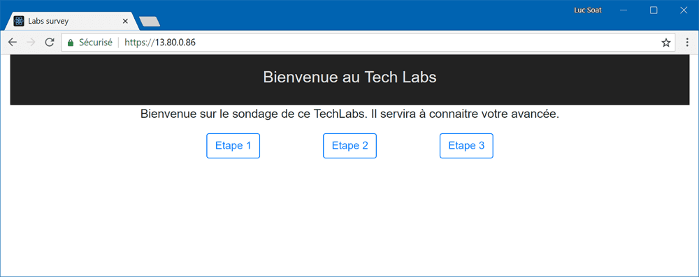

# Deployer l'application sur le Cluster

Maintenant que l'application et le cluster sont prêts nous allons voir comment héberger les images ainsi que les déployer sur le cluster Kubernetes.

A l'image des fichier docker-compose, les fichiers de configuration pour Kubernetes sont écrient en **yaml**. Pour chaque étape nous créerons un fichier yaml contenant les configurations de chaque service de l'application.

> #### Information 💡
>
> Comme nous voulons que cela soit déployé en même temps, nous mettrons chaque manifeste de chaque service dans le même fichier tout en veillant à bien séparer les manifestes par **---**.

## Deploiement de lab-survey-redis

Pour qu'une application soit déployée et soit accessible hors du pod sur Kubernetes, il faut déclarer deux ressources : un **Deployment** et un **Service**.

### Deploiement de la base de donnée

Pour le déployment on donnera comme metadata :

- un nom **lab-survey-redis** afin d'identifier la base de donnée.

La partie **spec** correspond aux configurations de votre pod, par le champ **replicat** qui permettra de définir le nombre d'instance qu'y devront être déployées par l'orchestrateur et le champs **template** qui, un peu comme un docker-compose, définit l'application.

Ce **template** comporte des **metadata**, permettant de donner un label qui permettra au service de matcher avec le pod, et à nouveau un champs **spec** où on pourra définir le container. En prenant exemple sur le docker compose, nous le nommerons **lab-survey-redis**. On prendra l'image **redis** et on précisera qu'on expose le **port** de redis (**6379**) du container grâce à **containerPort: 6379**.

```yaml
apiVersion: apps/v1
kind: Deployment
metadata:
  name: lab-survey-redis
spec:
  replicas: 1
  selector:
    matchLabels:
      app: lab-survey-redis
  template:
    metadata:
      labels:
        app: lab-survey-redis
    spec:
      containers:
        - name: lab-survey-redis
          image: redis
          ports:
            - containerPort: 6379
```

### Exposé la base de donnée à l'intérieur du cluster

Pour pouvoir exposer cette application de manière publique, ou comme dans notre cas entre deux pods, il faut lui déclarer un service. Pour ce faire, il faut déclarer un _kind_ de type **service**, puis lui donner un nom **lab-survey-redis**. Ensuite, nous définirons les **spec** du service :

- le port exposé, **6379**.
- Il faut aussi définir quel pod utiliser. Avec Kubernetes la bonne manière est de se baser sur les labels afin de matcher les services à une application. Dans ce cas, il faut utiliser le paramètre **selector** et nous lui donnerons donc simplement la règle **app: lab-survey-redis** qui est celle définie dans notre déploiement.

Le service par défaut sur Kubernetes est le _ClusterIP_, cela permet d'exposer un ou des pods (par répartition de charge) à d'autre à l'intérieur du cluster.

```yaml
apiVersion: v1
kind: Service
metadata:
  name: lab-survey-redis
spec:
  ports:
    - port: 6379
  selector:
    app: lab-survey-redis
```

Nous mettrons ces deux manifestes dans un fichier, que nous nommerons _lab-survey-redis.yaml_ et nous créerons les ressources grâce à la commande create en spécifiant le fichier avec le paramètre **-f**.

```sh
$ kubectl create -f lab-survey-redis.yaml
deployment "lab-survey-redis" created
service "lab-survey-redis" created
```

## Deploiement lab-survey-api

### Le déploiement de l'api

Il faut maintenant préparer le manifest du déploiement, nous prendrons donc **lab-survey-api** comme nom.

En plus du _template_ du pod, nous allons alors spécifier que nous ne voulons qu'une instance de ce pod, **replicas: 1**, et que la stratégie de mise à jour, en mise à jour part lot (**rollingUpdate**), sera de mettre à jour avec seulement une seule instance indisponible et en déployant une instance à la fois.

La partie _spec_ de ce _template_ se découpe en deux partie.

La première est l'**imagePullSecrets** qui permet de définir quel _secret_ prendre pour se connecter à la docker registry, nous lui spécifierons donc **azureregistry**.

La seconde partie est la définiont du _containers_ que nous configurerons comme suit :

- Un nom, qui sera donc **lab-survey-api**.
- l'**image** docker que nous utiliserons. Nous prendrons donc, sur notre registry **soattechlabregistry.azurecr.io**, l'image **lab-survey-api** et plus précisément la version du tag **1.0**.
- Comme pour le _docker-compose.yaml_ nous donnons deux variables d'environement (**env**) :
  - **REDIS** avec comme valeur le nom du service exposant la base de donnée (**lab-survey-redis**)
  - **ASPNETCORE_ENVIRONMENT** qui contiendra **Production** pour que l'application prenne la bonne configuration.
- Pour les _ports_, nous exposerons le port **5000**, qu'utilise l'application en .Net Core.

```yaml
apiVersion: apps/v1
kind: Deployment
metadata:
  name: lab-survey-api
spec:
  replicas: 1
  strategy:
    rollingUpdate:
      maxSurge: 1
      maxUnavailable: 1
  selector:
    matchLabels:
      app: lab-survey-api
  template:
    metadata:
      labels:
        app: lab-survey-api
    spec:
      imagePullSecrets:
        - name: azureregistry
      containers:
        - name: lab-survey-api
          image: soattechlabregistry.azurecr.io/lab-survey-api:1.0
          env:
            - name: REDIS
              value: 'lab-survey-redis'
            - name: ASPNETCORE_ENVIRONMENT
              value: 'Production'
          ports:
            - containerPort: 5000
```

### Exposition public de l'api

Maintenant que le pod du front est fait, il faut s'occuper du service qui nous permettra d'exposer l'api. Pour cela, on refait un service comme sur le redis et le _selector_ sera **app: lab-survey-api**, permettant de trouver les pods du front. La partie changeante sera celle sur le port, que nous nommerons **http**, car nous souhaitons déclarer une redirection du port **80** vers le port **5000** de l'application.

```yaml
apiVersion: v1
kind: Service
metadata:
  name: lab-survey-api
spec:
  ports:
    - name: http
      port: 80
      targetPort: 5000
  selector:
    app: lab-survey-api
```

Comme pour la base de donnée, nous réunirons les manifests en un fichier _lab-survey-api.yaml_ que nous passerons à `kubectl create` grâce au paramètre **-f**.

```sh
$ kubectl create -f lab-survey-api.yaml
deployment "lab-survey-api" created
service "lab-survey-api" created
```

## Deploiement lab-survey-front

Maintenant qu'on a deployé deux instances, je vous laisse imaginer que nous allons déployer le front. En partant sur ce que l'on sait déjà, je vous laisse imaginer le contenue du fichier _lab-survey-front.yaml_.

Je vous mets la réponse ci dessous au cas où :

```yaml
apiVersion: apps/v1
kind: Deployment
metadata:
  name: lab-survey-front
spec:
  replicas: 1
  strategy:
    rollingUpdate:
      maxSurge: 1
      maxUnavailable: 1
  selector:
    matchLabels:
      app: lab-survey-front
  template:
    metadata:
      labels:
        app: lab-survey-front
    spec:
      imagePullSecrets:
        - name: azureregistry
      containers:
        - name: lab-survey-front
          image: soattechlabregistry.azurecr.io/lab-survey-front:1.0
          ports:
            - containerPort: 5000
---
apiVersion: v1
kind: Service
metadata:
  name: lab-survey-front
spec:
  ports:
    - name: http
      port: 80
      targetPort: 80
  selector:
    app: lab-survey-front
```

## Test du deploiement

Afin de pouvoir tester l'application, et pouvoir s'en servir, il faut pouvoir y accèder depuis l'extérieur du Cluster. Pour cela, vous avez deux grandes solutions :

- Configurer le service _lab-survey-front_ en service de _type_ **LoadBalancer**, mais cela demenderait soit de configurer l'api en public avec un type LoadBalancer aussi, soit coder un reverse proxy pour que le front appel l'api via son Nginx. Dans tous les cas cette solution pose le problème que si pour chacun des services que vous exposez, vous récupérerez une adresse IP, votre provider de cloud va rapidement vous avertir que vous avez des limites, et qu'après cela sera payant (vu la raretée des IPv4)
- Crée un **Ingress** devant les services afin de servir justement de reverse proxy et de limiter à une IP pour tous les services que l'ingress reroutera. Cela est plutôt une bonne pratique quand vous n'êtes pas sur un cluster on promise.

Nous allons donc partir sur la création d'un **Ingress** en se servant de controllers implémentées par **nginx-ingress**, mais avant cela, nous nous occuperons du manifest de cette **ingress**. Donc le _kind_ sera **Ingress**, nous le nomerons **lab-survey** et nous ajouterons l'annotation _nginx.ingress.kubernetes.io/rewrite-target: /_ afin de faire croire aux targets que nous les appellons directement à partir de leur racine comme ils s'y attendent. Pour la partie _rules_ nous définirons la partie _http_ avec 2 _path_ :

- **/** Qui devra servir le service **lab-survey-front** sur le port **80**
- **/api** Qui devra servir le service **lab-survey-api** sur le port **80**

Cela nous donnera un fichier, que nous nommerons _lab-survey-ingress.yaml_, qui devrait ressembler à ceci :

```yaml
apiVersion: extensions/v1beta1
kind: Ingress
metadata:
  name: lab-survey
  annotations:
    nginx.ingress.kubernetes.io/rewrite-target: /
spec:
  rules:
    - http:
        paths:
          - path: /
            backend:
              serviceName: lab-survey-front
              servicePort: 80
          - path: /api
            backend:
              serviceName: lab-survey-api
              servicePort: 80
```

Il nous reste l'_ingresse controller_ et pour cela nous utiliserons _helm_ afin de mettre en place un ingress de type **nginx-ingress** grâce au package **stable/nginx-ingress**, la commande _helm install_ et le paramètre _name_ afin de lui donner un nom comme **reverse-proxy** . Cela donne `helm install stable/nginx-ingress --name reverse-proxy`.

```sh
> helm install stable/nginx-ingress --name reverse-proxy
NAME:   reverse-proxy
LAST DEPLOYED: Tue Jul 31 11:35:13 2018
NAMESPACE: default
STATUS: DEPLOYED

RESOURCES:
==> v1/ConfigMap
NAME                                    DATA  AGE
reverse-proxy-nginx-ingress-controller  1     2s

==> v1/Service
NAME                                         TYPE          CLUSTER-IP    EXTERNAL-IP  PORT(S)                     AGE
reverse-proxy-nginx-ingress-controller       LoadBalancer  10.0.164.182  <pending>    80:30584/TCP,443:31557/TCP  2s
reverse-proxy-nginx-ingress-default-backend  ClusterIP     10.0.63.133   <none>       80/TCP                      1s

==> v1beta1/Deployment
NAME                                         DESIRED  CURRENT  UP-TO-DATE  AVAILABLE  AGE
reverse-proxy-nginx-ingress-controller       1        1        1           0          1s
reverse-proxy-nginx-ingress-default-backend  1        1        1           0          1s

==> v1beta1/PodDisruptionBudget
NAME                                         MIN AVAILABLE  MAX UNAVAILABLE  ALLOWED DISRUPTIONS  AGE
reverse-proxy-nginx-ingress-controller       1              N/A              0                    1s
reverse-proxy-nginx-ingress-default-backend  1              N/A              0                    1s

==> v1/Pod(related)
NAME                                                         READY  STATUS             RESTARTS  AGE
reverse-proxy-nginx-ingress-controller-6f97d7bfff-qq9xj      0/1    ContainerCreating  0         1s
reverse-proxy-nginx-ingress-default-backend-b48c99776-27wx7  0/1    ContainerCreating  0         1s


NOTES:
The nginx-ingress controller has been installed.
It may take a few minutes for the LoadBalancer IP to be available.
You can watch the status by running 'kubectl --namespace default get services -o wide -w reverse-proxy-nginx-ingress-controller'

An example Ingress that makes use of the controller:

  apiVersion: extensions/v1beta1
  kind: Ingress
  metadata:
    annotations:
      kubernetes.io/ingress.class: nginx
    name: example
    namespace: foo
  spec:
    rules:
      - host: www.example.com
        http:
          paths:
            - backend:
                serviceName: exampleService
                servicePort: 80
              path: /
    # This section is only required if TLS is to be enabled for the Ingress
    tls:
        - hosts:
            - www.example.com
          secretName: example-tls

If TLS is enabled for the Ingress, a Secret containing the certificate and key must also be provided:

  apiVersion: v1
  kind: Secret
  metadata:
    name: example-tls
    namespace: foo
  data:
    tls.crt: <base64 encoded cert>
    tls.key: <base64 encoded key>
  type: kubernetes.io/tls
```

Avant de pouvoir tester, il va falloir récupérer l'ip public, le tempalte helm nous communique le moyen le plus simple de le faire donc nous ferons `kubectl --namespace default get services -o wide -w reverse-proxy-nginx-ingress-controller`

```sh
> kubectl --namespace default get services -o wide -w reverse-proxy-nginx-ingress-controller
NAME                                     TYPE           CLUSTER-IP     EXTERNAL-IP   PORT(S)                      AGE       SELECTOR
reverse-proxy-nginx-ingress-controller   LoadBalancer   10.0.164.182   13.80.0.86    80:30584/TCP,443:31557/TCP   4h        app=nginx-ingress,component=controller,release=reverse-proxy
```

Donc en allant sur l'_EXTERNAL-IP_, **13.80.0.86** dans mon cas, nous devrions tomber sur l'application et elle doit être totalement fonctionnelle.


## Félicitation, vous avez déployé votre premiere application avec un cluster Kubernetes sur azure. 🎊🏆🎉

Si vous êtes là, normalement, vous avez déployés votre première application dans un cluster Kubernetes sur azure tout en permettant de découpler les ressources de l'application, un serveur redis et votre code.

## Bonus : Economisé de l'argent

Lors de ce Techlab nous avons crée des ressources, quand nous aurons finis de les utiliser, il serait bien de les supprimer afin d'arrêter leur facturation. C'est une des raisons expliquant que nous avons crée les ressources dans un ressource groupe dédié. Pour cela, nous utiliserons la sous commande **detele** de la commande _az group_ ce qui donnera `az group delete --name soat-techlab`.

```sh
> az group delete --name soat-techlab
Are you sure you want to perform this operation? (y/n): Y
```
