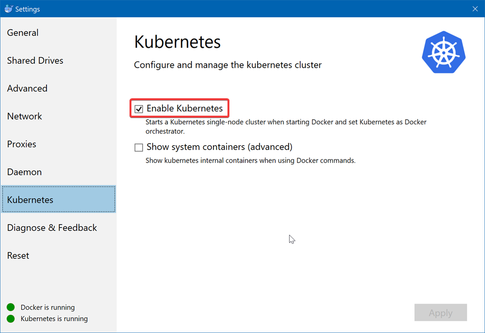

# Techlab docker et kubernetes sur Azure : Déployé vos premier pods sur Azure

Dans la lignée du précédent Techlab, nous allons voir comment déployer l'application dans Azure. Lors de ce Techlab nous reverrons la création des conteneurs **docker**, la création de l'infrastructure sur **Azure** (_Azure Registrey_ + _Azure Containeur Service_ avec l'orchestrateur **Kubernetes**), le déploiement des conteneurs avec la mise en place d'_ingress_, ainsi qu'un aperçu d'**Helm**.

## Prérequis 🏗️

- Docker for windows (version 18.03.1-ce-win65, build 17513) disponible sur le channel stable.
- Azure Cli (version 2.0.39)
- Kubectl (version 1.9.6)
- helm (version 2.9.1) [lien pour le téléchargement](https://github.com/kubernetes/helm/releases/tag/v2.9.1)

Une fois Docker for windows (ou mac) installé, il vous faudra activer la prise en charge de Kubernetes comme ci-dessous.

## Étapes 🏭

<ul>
  <li><a href="./1 - Build de l'image et test local sur docker.md">Build de l'image et test local sur docker.md</a></li>
  <li><a href="./2 - Registry et Kubernetes.md">Registry et Kubernetes</a></li>
</ul>
